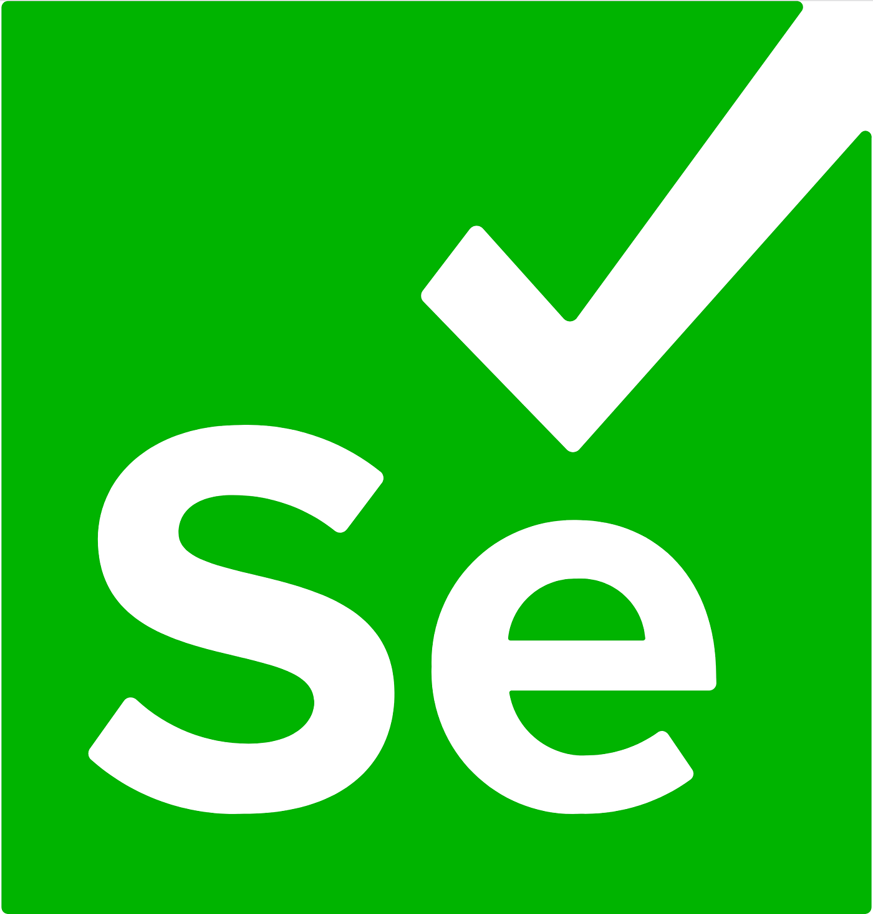

  

  

- 👋 Hi, I’m Yogesh-rana.  
- 👀 I’m interested in full stack development projects  
- 🌱 I’m currently learning DSA and TypeScript  
- 💞️ I’m looking to collaborate on frontend projects  
- 📫 How to reach me: **hi.yogeshrana@gmail.com**  
- 😄 Pronouns: he/him  

## 📊 GitHub Analytics

### 🏆 Profile Stats

### 🔥 Streak Stats

### 📈 Activity Graph

 
 

  

 
 

## 💻 Languages and Tools 
<table align="center">
  <tr>
      <td align="center"  width="96">
           
       AWS
    </td>
    <td align="center" width="96">
        
       Supabase
    </td>
    <td align="center" width="96">
           
       Docker
    </td>
    <td align="center" width="96">
        
       Python
    <td align="center" width="96">
           
       C++
    </td>
    <td align="center" width="96">
           
       C
    </td>
  </tr>
  <tr>
    <td align="center" width="96">
        
       Bootstrap
    </td>
    <td align="center" width="96">
        
       Linux
    </td>
    <td align="center" width="96">
        
       Tailwind
    </td>
    <td align="center"  width="96">
        
       React
    </td>
    <td align="center" width="96">
        
       Next.js
    </td>
    <td align="center"  width="96">
        
       MySQL
    </td>
  </tr>
  <tr>
    <td align="center"  width="96">
        
       Node.js
    </td>
    <td align="center" width="96">
           
       Django
    </td>
    <td align="center" width="96">
        
       FastAPI
    </td>
    <td align="center" width="96">
        
       MongoDB
    </td>
    <td align="center" width="96">
        
       Git
    </td>
    <td align="center" width="96">
        
       GitHub
    </td>
  </tr>
  <tr>
    <td align="center" width="96">
        
       GitLab
    </td>
    <td align="center" width="96">
        
       Vercel
    </td>
    <td align="center" width="96">
           
       Figma
    </td>
    <td align="center" width="96">
        
       AI
    </td>
    <td align="center" width="96">
        
       Bash
    </td>
    <td align="center" width="96">
           
       JavaScript
    </td>
  </tr>
  <tr>
    <td align="center" width="96">
        
       PostgreSQL
    </td>
    <td align="center" width="96">
           
       Raspberry
    </td>
    <td align="center" width="96">
           
       RestAPI
    </td>
    <td align="center" width="96">
        
       Anaconda
    </td>
    <td align="center" width="96">
        
       Bootstrap
    </td>
    <td align="center" width="96">
        
       Cloudflare
    </td>
  </tr>
  <tr>
  <td align="center" width="96">
        
       Notion
    </td>
    <td align="center" width="96">
        
       Postman
    </td>
    <td align="center" width="96">
        
       R
    </td>
    <td align="center" width="96">
        
       stackoverflow
    </td>
    <td align="center" width="96">
        
       Supabase
    </td>
    <td align="center" width="96">
        
       sklearn
    </td>
  </tr>
  <tr>
    <td align="center" width="96">
        
       Css
    </td>
    <td align="center" width="96">
        
       HTML
    </td>
    <td align="center" width="96">
        
       JQuery
    </td>
    <td align="center" width="96">
        
       Latex
    </td>
    <td align="center" width="96">
        
       md
    </td>
    <td align="center" width="96">
        
       Ubuntu
    </td>
  </tr>
  <tr>
    <td align="center" width="96">
        
       Neovim
    </td>
    <td align="center" width="96">
           
       TypeScript
    </td>
    <td align="center" width="96">
        
       vim
    </td>
    <td align="center" width="96">
        
       vscode
    </td>
    <td align="center" width="96">
        
       SQLite
    </td>
    <td align="center" width="96">
           
       Selenium
    </td>
  </tr>
</table>

<!---
Yogesh-rana-2301/Yogesh-rana-2301 is a ✨ special ✨ repository because its `README.md` (this file) appears on your GitHub profile.
You can click the Preview link to take a look at your changes.
--->
